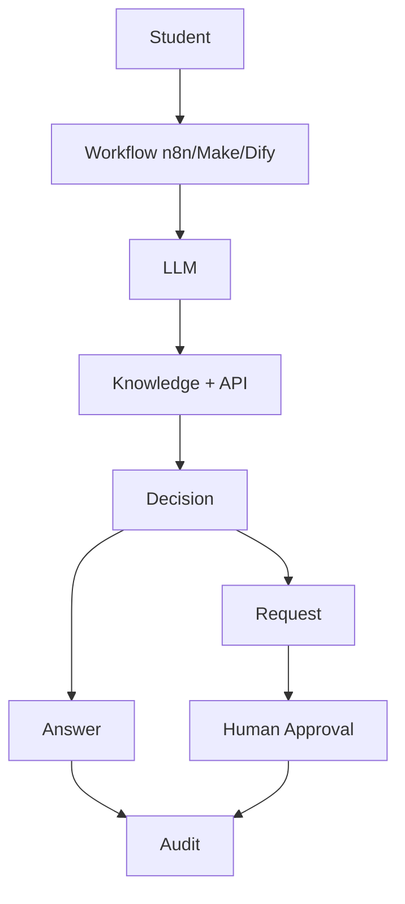

# FIAP Student Desk Lab
## Central Inteligente de Solicitações Acadêmicas

> **Aviso:** Este projeto é um laboratório educacional fictício e não representa sistemas ou políticas oficiais da FIAP. Todo o conteúdo é criado para fins didáticos.

API pedagógica para a disciplina FIAP de Tools, Automations and Workflows. Representa uma central inteligente de solicitações acadêmicas (FIAP Student Desk Lab).

## Contexto

O objetivo é permitir que alunos explorem:
- REST APIs (GET/POST/PATCH)
- Path parameters, headers, JSON
- Webhooks, HTTP Request
- Mapping, routing
- LLM workflows, structured output, tool calling
- RAG (Retrieval Augmented Generation) com Knowledge Base
- Error handling, timeout, retry, rate limiting
- Human-in-the-Loop (Aprovações)
- Observabilidade e Auditoria
- Contratos OpenAPI

## Arquitetura



## Requisitos

- Python 3.12
- pip

## Instalação

### Criar venv

**Mac/Linux:**
```bash
python3.12 -m venv .venv
source .venv/bin/activate
```

**Windows:**
```bash
python3.12 -m venv .venv
.venv\Scripts\activate
```

### Instalar dependências

```bash
cd api
pip install -r requirements.txt
```

Para desenvolvimento (com testes):
```bash
pip install -r requirements-dev.txt
```

## Executar

```bash
cd api
uvicorn app.main:app --reload --host 0.0.0.0 --port 8000
```

## Swagger

Acesse: http://localhost:8000/docs

## OpenAPI

Acesse: http://localhost:8000/openapi.json

## Testar

```bash
cd api
pytest -v
```

## Docker

```bash
cd api
docker build -t fiap-student-desk-api .
docker run -p 8000:8000 fiap-student-desk-api
```

## Deploy

- Railway: veja [docs/RAILWAY_DEPLOY.md](docs/RAILWAY_DEPLOY.md)
- GitHub: veja [docs/GITHUB_SETUP.md](docs/GITHUB_SETUP.md)

## API Endpoints

| Method | Path | Description |
|--------|------|-------------|
| GET | `/` | Root endpoint |
| GET | `/health` | Health check |
| GET | `/api/v1/students` | List students |
| GET | `/api/v1/students/{student_id}` | Get student details |
| GET | `/api/v1/departments` | List departments |
| GET | `/api/v1/departments/{category}` | Get department details |
| GET | `/api/v1/knowledge` | List knowledge articles |
| GET | `/api/v1/knowledge/search` | Search knowledge base |
| GET | `/api/v1/knowledge/{article_id}` | Get knowledge article |
| POST | `/api/v1/priority/check` | Check request priority |
| POST | `/api/v1/requests` | Create academic request |
| GET | `/api/v1/requests` | List requests |
| GET | `/api/v1/requests/{request_id}` | Get request details |
| PATCH | `/api/v1/requests/{request_id}` | Update request status |
| POST | `/api/v1/interactions` | Register student interaction |
| GET | `/api/v1/interactions` | List interactions |
| GET | `/api/v1/interactions/{interaction_id}` | Get interaction details |
| POST | `/api/v1/approval-requests` | Create approval request |
| GET | `/api/v1/approval-requests/{approval_id}` | Get approval details |
| POST | `/api/v1/approval-requests/{approval_id}/decision` | Register approval decision |
| GET | `/api/v1/events` | List audit events |
| GET | `/api/v1/lab/slow` | Simulated slow response |
| GET | `/api/v1/lab/error` | Simulated 500 error |
| GET | `/api/v1/lab/rate-limit` | Rate limit demo |
| GET | `/api/v1/lab/not-found` | Simulated 404 |
| POST | `/api/v1/lab/validation` | Validation error demo |

## X-Student-ID

Todos os endpoints suportam o header `X-Student-ID` para isolar registros entre grupos de alunos.

```bash
curl -H "X-Student-ID: grupo-07" http://localhost:8000/api/v1/requests
```

Se não enviado, o valor padrão é `anonymous`.

## Documentação

- [Case Study](docs/CASE.md) - Detalhes do caso de uso
- [N8N Lab](docs/N8N_LAB.md) - Workflows n8n
- [Make Lab](docs/MAKE_LAB.md) - Workflows Make
- [Dify Lab](docs/DIFY_LAB.md) - Integração Dify
- [Architecture](docs/ARCHITECTURE.md) - Diagrama de arquitetura
- [API Contracts](docs/API_CONTRACTS.md) - Contratos da API
- [Classroom Scenarios](docs/CLASSROOM_SCENARIOS.md) - Cenários didáticos
