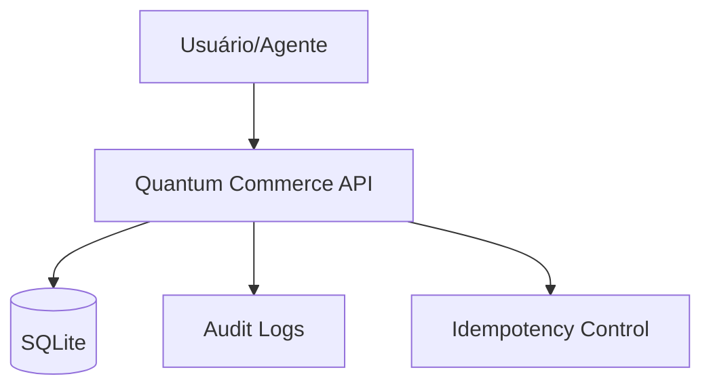

# Quantum Commerce API
## Backend Oficial do Case de E-commerce

> **Aviso:** Este projeto é um laboratório educacional fictício criado para a disciplina de Tools, Automations and Workflows da FIAP. Todo o conteúdo e dados são simulados para fins didáticos.

A Quantum Commerce API é um backend robusto e determinístico projetado para servir como base em exercícios de automação, integração de sistemas e desenvolvimento de agentes de IA. Ela simula as operações de uma grande plataforma de e-commerce, abrangendo desde o catálogo de produtos até processos complexos de logística, suporte e aprovações financeiras.

## Contexto

O objetivo deste laboratório é permitir que os alunos explorem cenários reais de integração:
- Consumo de APIs REST (GET, POST, PATCH)
- Manipulação de headers, path parameters e query strings
- Implementação de fluxos de trabalho (n8n, Make, Dify)
- Orquestração de agentes de IA com Tool Calling
- Tratamento de erros, idempotência e limites de taxa (Rate Limiting)
- Processos de Human-in-the-Loop (Aprovações manuais)
- Auditoria e rastreabilidade de eventos

## Arquitetura

A API foi construída com FastAPI e SQLAlchemy 2.0, utilizando um banco de dados SQLite para garantir portabilidade e determinismo. Os dados são populados automaticamente via seed no início da aplicação.



## Requisitos

- Python 3.12 ou superior
- pip

## Instalação e Execução

### 1. Preparar o ambiente

**Mac/Linux:**
```bash
python3 -m venv .venv
source .venv/bin/activate
```

**Windows:**
```bash
python -m venv .venv
.venv\Scripts\activate
```

### 2. Instalar dependências

```bash
cd api
pip install -r requirements.txt
```

Para desenvolvimento e testes:
```bash
pip install -r requirements-dev.txt
```

### 3. Executar a API

```bash
cd api
uvicorn app.main:app --reload --host 0.0.0.0 --port 8000
```

A API estará disponível em `http://localhost:8000`.
O Swagger pode ser acessado em `http://localhost:8000/docs`.

## Variáveis de Ambiente

A configuração é feita via variáveis de ambiente ou arquivo `.env` na pasta `api/`.

| Variável | Descrição | Padrão |
|----------|-----------|---------|
| `APP_NAME` | Nome da aplicação | `Quantum Commerce API` |
| `ENVIRONMENT` | Ambiente de execução | `development` |
| `DATABASE_URL` | URL de conexão do banco | `sqlite:///./quantum_commerce.db` |
| `LOG_LEVEL` | Nível de log (DEBUG, INFO, etc) | `INFO` |
| `CORS_ORIGINS` | Origens permitidas para CORS | `*` |
| `VERSION` | Versão da API | `2.0.0` |
| `REFUND_APPROVAL_THRESHOLD` | Limite para aprovação manual de reembolso | `500.0` |
| `RETURN_WINDOW_DAYS` | Janela padrão para devoluções (dias) | `30` |

## Headers Especiais

### X-Lab-Group
Utilizado para isolar registros entre diferentes grupos ou alunos. Se não enviado, assume o valor `anonymous`.
```bash
curl -H "X-Lab-Group: grupo-alfa" http://localhost:8000/api/v1/customers/CUS-1001
```

### Idempotency-Key
Obrigatório em endpoints de criação que exigem proteção contra duplicidade (Returns, Support Cases, Approvals, Refunds).
```bash
curl -X POST -H "Idempotency-Key: unique-uuid-123" -H "Content-Type: application/json" \
     -d '{"order_id": "ORD-2026-10001", "amount": 150.0, "reason": "Defeito"}' \
     http://localhost:8000/api/v1/refunds
```

## Endpoints Principais

| Categoria | Método | Caminho | Descrição |
|-----------|--------|---------|-----------|
| **Meta** | GET | `/api/v1/meta` | Informações do serviço e contagem de entidades |
| **Customers** | GET | `/api/v1/customers/search` | Busca de clientes por nome ou email |
| **Catalog** | GET | `/api/v1/products/search` | Busca no catálogo com filtros de preço e categoria |
| **Inventory** | GET | `/api/v1/inventory/{sku}` | Consulta de estoque por armazém |
| **Orders** | GET | `/api/v1/orders/{id}` | Detalhes do pedido e itens |
| **Logistics** | GET | `/api/v1/shipments/{id}` | Rastreamento e eventos de entrega |
| **Returns** | POST | `/api/v1/returns/check-eligibility` | Verifica se um item pode ser devolvido |
| **Support** | POST | `/api/v1/support/cases` | Abertura de tickets de suporte |
| **Approvals** | POST | `/api/v1/approvals` | Solicitação de aprovação (ex: reembolso alto) |
| **Refunds** | POST | `/api/v1/refunds` | Processamento de estornos financeiros |
| **Promotions** | GET | `/api/v1/promotions/eligible` | Consulta de promoções aplicáveis |
| **Lab** | GET | `/api/v1/lab/slow` | Endpoint para teste de timeout |

## Documentação Adicional

- [Referência da API](docs/API_REFERENCE.md) - Detalhes técnicos de cada endpoint
- [Modelo de Dados](docs/DATA_MODEL.md) - Estrutura das tabelas e relacionamentos
- [Cenários de Laboratório](docs/LAB_SCENARIOS.md) - Guia de exercícios práticos

## Comandos Úteis

- **Resetar Banco:** `python ../scripts/reset_lab.py` (apaga e recria com seed)
- **Re-seed:** `python ../scripts/seed_quantum.py` (popula dados mantendo o banco)
- **Smoke Test:** `python ../scripts/smoke_test.py` (valida se os endpoints estão ativos)
- **Testes Unitários:** `pytest -v`
