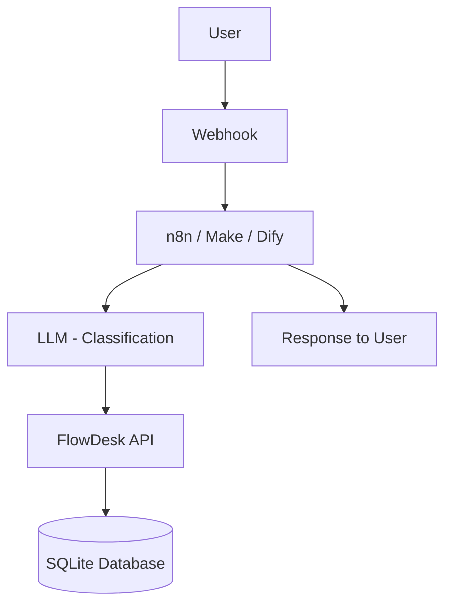
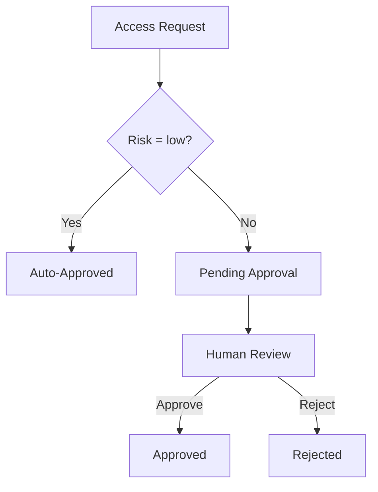
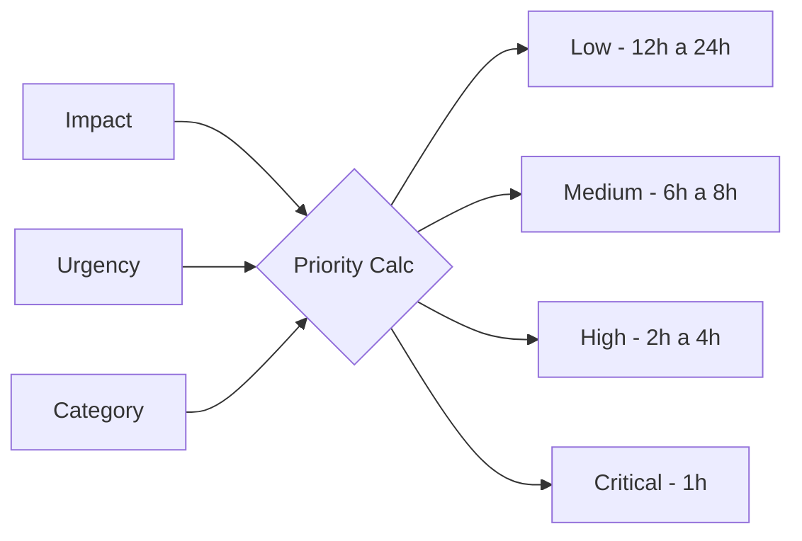

# Architecture

## System Flow

## Human-in-the-Loop Flow

## Priority Matrix

## Notas arquiteturais

- a API expõe endpoints REST simples para consumo por workflows e agentes
- o banco usado no laboratório é SQLite
- `X-Student-ID` funciona como contexto didático entre grupos
- a rota de prioridade usa regra determinística baseada em `impact`, `urgency` e override para `security`
- apenas `risk = low` segue autoaprovação; `medium` e `high` passam por `pending_approval`
- as rotas `lab/*` existem para exercícios de timeout, erro, rate limit e validação
