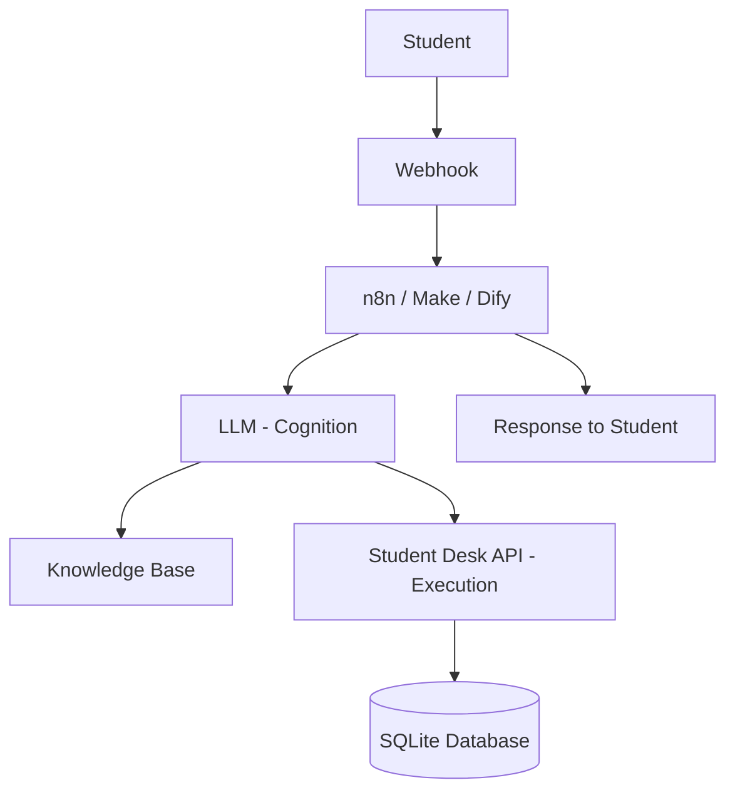
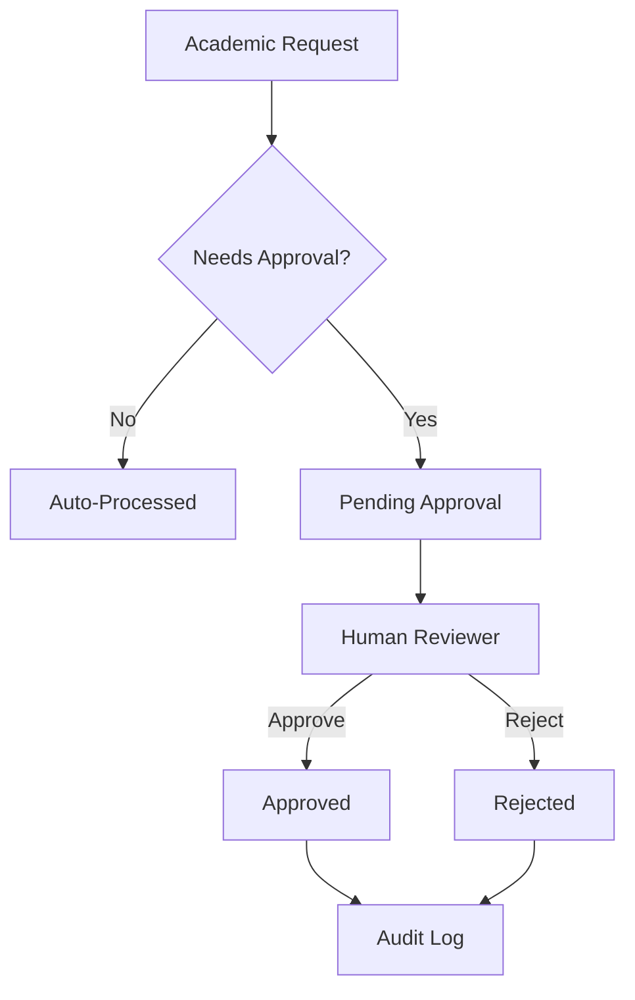
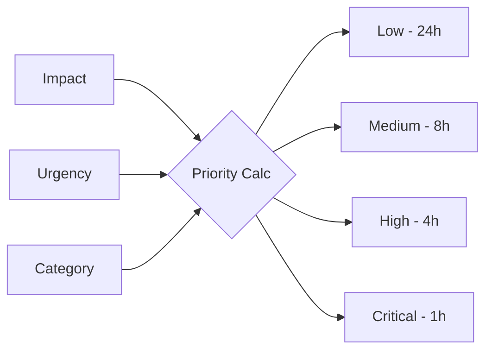

# Architecture: FIAP Student Desk Lab

## System Flow

## Human-in-the-Loop Flow (Aprovações)

## Priority Matrix

## Notas Arquiteturais

- **Separação de Responsabilidades:** O LLM cuida da cognição (entendimento e geração), enquanto a API cuida da execução (dados e persistência).
- **Base de Conhecimento (RAG):** A API fornece endpoints de busca semântica para alimentar o contexto do LLM.
- **Isolamento Didático:** O header `X-Student-ID` permite que múltiplos grupos usem a mesma API sem misturar dados.
- **Resiliência:** A arquitetura prevê o tratamento de falhas simuladas (timeout, 500, 429) nos workflows.
- **Auditoria:** Todas as interações e decisões são registradas no endpoint `/api/v1/events`.

## Endpoints Principais
- **Students:** Dados cadastrais dos alunos.
- **Knowledge:** Artigos de ajuda e busca.
- **Requests:** Gestão de solicitações acadêmicas.
- **Interactions:** Registro de conversas com o assistente.
- **Approval:** Fluxo de decisão humana.
- **Lab:** Simuladores de falhas para testes de robustez.
