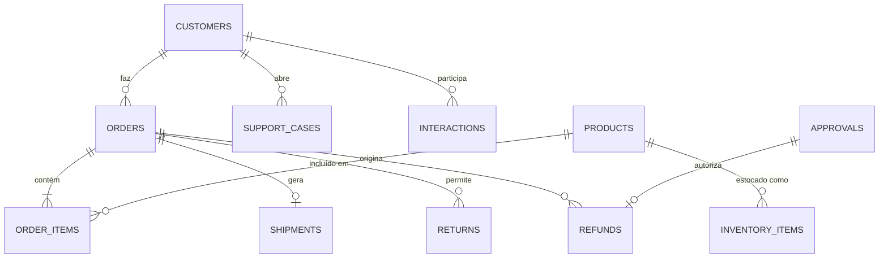

# Modelo de Dados: Quantum Commerce

Este documento descreve as entidades, campos e relacionamentos do banco de dados da Quantum Commerce API. O sistema utiliza SQLite com SQLAlchemy 2.0.

## Diagrama de Entidade-Relacionamento (ER)

## Entidades Principais

### 1. Customers (`customers`)
Armazena os dados cadastrais e de fidelidade dos clientes.
- **Campos:**
  - `id` (String, PK): Identificador único (ex: `CUS-1001`).
  - `name` (String): Nome completo.
  - `email` (String, Unique): Endereço de e-mail.
  - `country` (String): Código do país (BR, MX, AR, etc).
  - `segment` (String): Segmento (premium, standard, budget).
  - `loyalty_tier` (String): Nível de fidelidade (platinum, gold, silver, bronze, none).
  - `customer_since` (Date): Data de cadastro.
  - `lifetime_value` (Float): Valor total gasto na plataforma.
  - `total_orders` (Integer): Contagem total de pedidos.

### 2. Products (`products`)
Catálogo de produtos disponíveis.
- **Campos:**
  - `sku` (String, PK): Código único do produto (ex: `QTM-NBK-00123`).
  - `name` (String): Nome comercial.
  - `category` (String): Categoria principal (electronics, fashion, etc).
  - `brand` (String): Marca do fabricante.
  - `price` (Float): Preço unitário em BRL.
  - `rating` (Float): Avaliação média (0.0 a 5.0).

### 3. Inventory Items (`inventory_items`)
Controle de estoque por armazém.
- **Campos:**
  - `sku` (String): Referência ao produto.
  - `warehouse_id` (String): Identificador do armazém (ex: `BR-SP-01`).
  - `city` (String): Cidade onde o armazém está localizado.
  - `available` (Integer): Quantidade disponível para venda.
  - `reserved` (Integer): Quantidade reservada em pedidos pendentes.

### 4. Orders (`orders`)
Cabeçalho dos pedidos realizados.
- **Campos:**
  - `id` (String, PK): Número do pedido (ex: `ORD-2026-10001`).
  - `customer_id` (String): Referência ao cliente.
  - `status` (String): Status atual (pending, confirmed, shipped, delivered, cancelled, etc).
  - `total` (Float): Valor total do pedido.
  - `created_at` (DateTime): Data e hora da criação.

### 5. Order Items (`order_items`)
Itens individuais contidos em um pedido.
- **Campos:**
  - `order_id` (String): Referência ao pedido.
  - `sku` (String): Referência ao produto.
  - `quantity` (Integer): Quantidade comprada.
  - `unit_price` (Float): Preço unitário no momento da compra.

### 6. Shipments (`shipments`)
Informações de logística e rastreamento.
- **Campos:**
  - `shipment_id` (String, PK): Identificador do envio (ex: `SHP-87421`).
  - `order_id` (String, Unique): Referência ao pedido.
  - `carrier` (String): Transportadora responsável.
  - `status` (String): Status logístico (in_transit, delivered, delayed, lost).
  - `tracking_code` (String): Código de rastreio.
  - `events` (JSON): Lista de eventos históricos do envio.

### 7. Support Cases (`support_cases`)
Tickets de atendimento ao cliente.
- **Campos:**
  - `case_id` (String, PK): Identificador do caso (ex: `CASE-2026-10021`).
  - `protocol` (String): Protocolo amigável (ex: `QCS-10021`).
  - `customer_id` (String): Referência ao cliente.
  - `category` (String): Categoria do problema (delivery, refund, etc).
  - `priority` (String): Prioridade (P1, P2, P3, P4).
  - `status` (String): Status (open, in_progress, resolved, closed).

### 8. Returns (`returns`)
Registros de solicitações de devolução.
- **Campos:**
  - `return_id` (String, PK): Identificador da devolução (ex: `RET-90016`).
  - `protocol` (String): Protocolo (ex: `QRET-2026-90016`).
  - `order_id` (String): Referência ao pedido.
  - `sku` (String): Produto sendo devolvido.
  - `status` (String): Status (requested, approved, received, refunded, rejected).

### 9. Approvals (`approvals`)
Solicitações de aprovação para processos críticos.
- **Campos:**
  - `approval_id` (String, PK): Identificador (ex: `APR-1011`).
  - `type` (String): Tipo (refund, fraud_review, etc).
  - `amount` (Float): Valor envolvido, se aplicável.
  - `status` (String): Status (pending, approved, rejected).

### 10. Refunds (`refunds`)
Processamentos de estorno financeiro.
- **Campos:**
  - `refund_id` (String, PK): Identificador (ex: `REF-10007`).
  - `order_id` (String): Referência ao pedido.
  - `amount` (Float): Valor estornado.
  - `approval_id` (String, Nullable): Referência à aprovação, se exigida.

## Dados Determinísticos (Seed)

O banco de dados é populado com um conjunto fixo de dados para garantir que os testes sejam repetíveis:
- **Clientes:** 50 registros (CUS-1001 a CUS-1050).
- **Produtos:** 171 SKUs em diversas categorias.
- **Pedidos:** 91 pedidos com históricos variados.
- **Políticas:** 20 regras de negócio (devolução, frete, garantia).
- **Casos de Suporte:** 20 tickets iniciais.
- **Devoluções:** 15 registros.
- **Aprovações:** 10 solicitações.
- **Reembolsos:** 2 registros iniciais.
