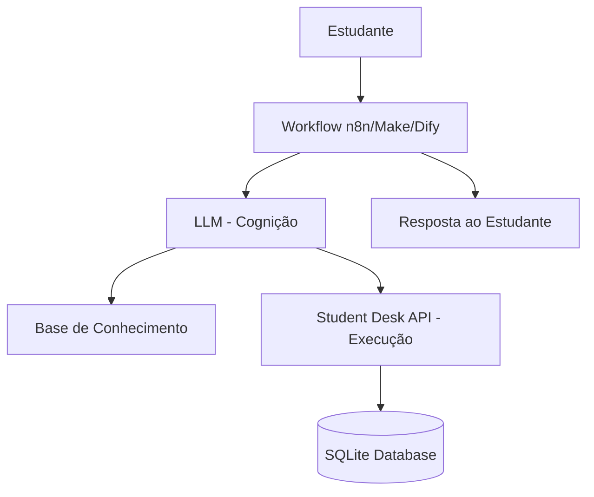
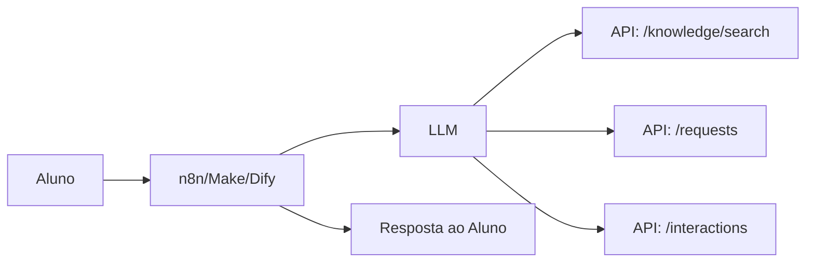

# FIAP Student Desk Lab - Guia Completo

## Central Inteligente de Solicitações Acadêmicas

> **Aviso:** Este projeto é um laboratório educacional fictício e não representa sistemas ou políticas oficiais da FIAP. Todo o conteúdo é criado para fins didáticos.

---

## Índice

1. [Visão Geral do Projeto](#1-visão-geral-do-projeto)
2. [Para Professores](#2-para-professores)
3. [Para Alunos](#3-para-alunos)
4. [Instalação e Configuração](#4-instalação-e-configuração)
5. [Documentação da API](#5-documentação-da-api)
6. [Exemplos de Uso com cURL](#6-exemplos-de-uso-com-curl)
7. [Integração com Ferramentas de Automação](#7-integração-com-ferramentas-de-automação)
8. [Cenários de Laboratório](#8-cenários-de-laboratório)
9. [Solução de Problemas](#9-solução-de-problemas)

---

## 1. Visão Geral do Projeto

### O que é o FIAP Student Desk Lab?

O FIAP Student Desk Lab é uma **API pedagógica** desenvolvida para a disciplina de Tools, Automations and Workflows da FIAP. Ele simula uma **Central Inteligente de Solicitações Acadêmicas** onde estudantes podem interagir com um assistente virtual para resolver dúvidas e fazer solicitações acadêmicas.

### Por que usar este laboratório?

Este laboratório permite que alunos explorem:

- **REST APIs** (GET/POST/PATCH)
- **Webhooks** e **HTTP Request**
- **LLM Workflows** com structured output e tool calling
- **RAG (Retrieval Augmented Generation)** com Knowledge Base
- **Error handling**, timeout, retry e rate limiting
- **Human-in-the-Loop** (Aprovações)
- **Observabilidade e Auditoria**
- **Contratos OpenAPI**

### Arquitetura do Sistema



**Fluxo Resumido:**
1. O estudante envia uma pergunta ou solicitação
2. O workflow (n8n/Make/Dify) processa a requisição
3. O LLM entende a intenção e busca informações na Base de Conhecimento
4. A API executa ações (criar solicitação, buscar dados, etc.)
5. O workflow retorna a resposta ao estudante

---

## 2. Para Professores

### 2.1 Objetivos Pedagógicos

Este laboratório foi projetado para ensinar:

| Conceito | Como é Abordado |
|----------|-----------------|
| **REST APIs** | Endpoints CRUD para estudantes, conhecimento, solicitações |
| **Webhooks** | Integração com workflows de automação |
| **LLM Workflows** | Uso de LLM para entender e responder solicitações |
| **RAG** | Busca semântica na base de conhecimento |
| **Error Handling** | Endpoints de simulação de falhas (timeout, 500, 429) |
| **Human-in-the-Loop** | Fluxo de aprovação para ações sensíveis |
| **Auditoria** | Registro de todas as interações e decisões |

### 2.2 Como Preparar a Aula

#### Antes da Aula

1. **Clone o repositório** e certifique-se de que o servidor está rodando
2. **Teste os endpoints** principais para garantir que tudo funciona
3. **Prepare os cenários** que os alunos vão explorar
4. **Verifique se os webhooks** estão configurados nos workflows

#### Estrutura Sugerida da Aula

| Momento | Atividade | Duração |
|---------|-----------|---------|
| **Abertura** | Apresentar o contexto e objetivos | 10 min |
| **Demonstração** | Mostrar a API funcionando via Swagger | 15 min |
| **Prática Guiada** | Alunos testam endpoints com cURL/Postman | 20 min |
| **Automação** | Configurar workflow no n8n/Make/Dify | 30 min |
| **Discussão** | Revisar resultados e conceitos | 15 min |

### 2.3 Cenários Disponíveis

A API inclui **5 cenários de laboratório** para testar tratamento de erros:

| Endpoint | Comportamento | Conceito Ensinado |
|----------|---------------|-------------------|
| `/api/v1/lab/slow` | Resposta lenta (delay) | Timeout e Retry |
| `/api/v1/lab/error` | Retorna HTTP 500 | Error Handling |
| `/api/v1/lab/rate-limit` | Retorna HTTP 429 após 3 chamadas | Rate Limiting |
| `/api/v1/lab/not-found` | Retorna HTTP 404 | Tratamento de recurso ausente |
| `/api/v1/lab/validation` | Retorna HTTP 422 para dados inválidos | Validação de schema |

### 2.4 Avaliação

Sugestões de atividades para avaliação:

1. **Exercício Prático:** Criar um workflow completo que responda a uma pergunta do aluno
2. **Teste de Robustez:** Implementar retry e error handling nos workflows
3. **Análise de Auditoria:** Verificar se todas as interações foram registradas
4. **Human-in-the-Loop:** Configurar um fluxo de aprovação para ações sensíveis

---

## 3. Para Alunos

### 3.1 Bem-vindo ao Laboratório!

Este é um ambiente seguro para você praticar automação e integração de APIs. **Nenhum dado aqui é real** - tudo é fictício e criado para fins didáticos.

### 3.2 Pré-requisitos

Antes de começar, certifique-se de ter:

- [ ] Python 3.12 instalado
- [ ] Um editor de código (VS Code, PyCharm, etc.)
- [ ] Uma ferramenta para testar APIs (Postman, Insomnia, ou curl)
- [ ] Acesso ao terminal/linha de comando

### 3.3 Passo a Passo: Primeiros Passos

#### Passo 1: Clonar o Repositório

```bash
git clone https://github.com/seu-usuario/fiap-student-desk-lab.git
cd fiap-student-desk-lab
```

#### Passo 2: Criar Ambiente Virtual

**Mac/Linux:**
```bash
python3.12 -m venv .venv
source .venv/bin/activate
```

**Windows:**
```bash
python3.12 -m venv .venv
.venv\Scripts\activate
```

#### Passo 3: Instalar Dependências

```bash
cd api
pip install -r requirements.txt
```

#### Passo 4: Iniciar o Servidor

```bash
uvicorn app.main:app --reload --host 0.0.0.0 --port 8000
```

#### Passo 5: Acessar a Documentação

Abra seu navegador e acesse:
- **Swagger UI:** http://localhost:8000/docs
- **OpenAPI:** http://localhost:8000/openapi.json

### 3.4 Testando os Endpoints

#### Verificando se a API está funcionando

```bash
curl http://localhost:8000/health
```

Resposta esperada:
```json
{
  "status": "healthy",
  "version": "1.0.0"
}
```

#### Listando artigos de conhecimento

```bash
curl http://localhost:8000/api/v1/knowledge
```

#### Buscando na base de conhecimento

```bash
curl "http://localhost:8000/api/v1/knowledge/search?q=wifi&category=technology"
```

#### Criando uma solicitação

```bash
curl -X POST http://localhost:8000/api/v1/requests \
  -H "Content-Type: application/json" \
  -H "X-Student-ID: grupo-01" \
  -d '{
    "student_id": "STU001",
    "category": "academic_services",
    "summary": "Preciso de declaração de matrícula",
    "description": "Preciso da declaração para processo de estágio"
  }'
```

### 3.5 Header Importante: X-Student-ID

O header `X-Student-ID` é usado para **isolar dados entre grupos**. Sempre que fizer uma requisição, inclua este header:

```bash
curl -H "X-Student-ID: seu-grupo" http://localhost:8000/api/v1/requests
```

Isso garante que seu grupo só veja seus próprios dados.

### 3.6 Explorando a Base de Conhecimento

A base de conhecimento tem **50 artigos** cobrindo diversas categorias:

| Categoria | Descrição | Exemplo de Artigo |
|-----------|-----------|-------------------|
| `digital_learning` | Ambiente virtual, senhas, materiais | "Como acessar o ambiente digital" |
| `academic_services` | Declarações, matrículas, transferências | "Solicitação de declaração de matrícula" |
| `finance` | Mensalidades, bolsas, pagamentos | "Entendendo sua fatura" |
| `career` | Estágios, carreira, entrevistas | "Informações sobre estágio" |
| `campus_access` | Crachá, acesso, estacionamento | "Problemas de acesso ao lab" |
| `technology` | Wi-Fi, VPN, software, projetor | "Solução de problemas de Wi-Fi" |
| `student_experience` | Eventos, clubes, bem-estar | "Próximos eventos e atividades" |
| `library` | Livros, salas, empréstimos | "Acesso a recursos da biblioteca" |

#### Buscando Artigos

```bash
# Buscar por palavra-chave
curl "http://localhost:8000/api/v1/knowledge/search?q=senha"

# Buscar por categoria
curl "http://localhost:8000/api/v1/knowledge?category=technology"

# Buscar artigo específico
curl http://localhost:8000/api/v1/knowledge/KB001
```

### 3.7 Criando uma Solicitação Acadêmica

```bash
curl -X POST http://localhost:8000/api/v1/requests \
  -H "Content-Type: application/json" \
  -H "X-Student-ID: grupo-01" \
  -d '{
    "student_id": "STU001",
    "category": "academic_services",
    "priority": "medium",
    "summary": "Preciso de declaração de matrícula",
    "description": "Preciso da declaração para processo de estágio em empresa de tecnologia"
  }'
```

Resposta:
```json
{
  "request_id": "REQ-1001",
  "student_id": "STU001",
  "category": "academic_services",
  "priority": "medium",
  "status": "open",
  "summary": "Preciso de declaração de matrícula",
  "description": "Preciso da declaração para processo de estágio em empresa de tecnologia",
  "protocol": "20260913-001",
  "created_at": "2026-09-13T10:00:00"
}
```

### 3.8 Registrando uma Interação

```bash
curl -X POST http://localhost:8000/api/v1/interactions \
  -H "Content-Type: application/json" \
  -H "X-Student-ID: grupo-01" \
  -d '{
    "student_id": "STU001",
    "request_text": "Como acesso o ambiente digital de aprendizagem?",
    "category": "digital_learning",
    "response_type": "automatic",
    "response_text": "Use o passo a passo do artigo KB001.",
    "knowledge_articles": ["KB001"],
    "source": "api"
  }'
```

### 3.9 Verificando Prioridade

```bash
curl -X POST http://localhost:8000/api/v1/priority/check \
  -H "Content-Type: application/json" \
  -d '{
    "category": "campus_access",
    "impact": "high",
    "urgency": "high"
  }'
```

Resposta:
```json
{
  "priority": "critical",
  "sla_hours": 1,
  "requires_escalation": true,
  "rule": "high_high_impact_urgency"
}
```

### 3.10 Human-in-the-Loop: Aprovações

Para ações sensíveis, é necessária aprovação humana:

#### Criar Pedido de Aprovação

```bash
curl -X POST http://localhost:8000/api/v1/approval-requests \
  -H "Content-Type: application/json" \
  -H "X-Student-ID: grupo-01" \
  -d '{
    "student_id": "STU001",
    "request_type": "visitor_campus_authorization",
    "justification": "Preciso autorizar acesso de visitante para apresentação de estágio",
    "risk": "high"
  }'
```

#### Aprovar ou Rejeitar

```bash
curl -X POST http://localhost:8000/api/v1/approval-requests/APR-501/decision \
  -H "Content-Type: application/json" \
  -H "X-Student-ID: grupo-01" \
  -d '{
    "decision": "approve",
    "approved_by": "professor-silva",
    "comment": "Autorizado para fins didáticos"
  }'
```

### 3.11 Verificando Auditoria

```bash
curl http://localhost:8000/api/v1/events \
  -H "X-Student-ID: grupo-01"
```

Isso retorna todos os eventos registrados para seu grupo.

---

## 4. Instalação e Configuração

### 4.1 Requisitos

- Python 3.12 ou superior
- pip
- Git

### 4.2 Instalação Local

```bash
# 1. Clone o repositório
git clone https://github.com/seu-usuario/fiap-student-desk-lab.git
cd fiap-student-desk-lab

# 2. Crie o ambiente virtual
python3.12 -m venv .venv
source .venv/bin/activate  # Mac/Linux
# .venv\Scripts\activate   # Windows

# 3. Instale as dependências
cd api
pip install -r requirements.txt

# 4. Para desenvolvimento (com testes)
pip install -r requirements-dev.txt

# 5. Inicie o servidor
uvicorn app.main:app --reload --host 0.0.0.0 --port 8000
```

### 4.3 Instalação com Docker

```bash
# Build da imagem
docker build -t fiap-student-desk-api .

# Executar o container
docker run -p 8000:8000 fiap-student-desk-api
```

### 4.4 Variáveis de Ambiente

Crie um arquivo `.env` na pasta `api/`:

```env
APP_NAME=FIAP Student Desk Lab API
ENVIRONMENT=development
DATABASE_URL=sqlite:///./fiap_student_desk.db
CORS_ORIGINS=*
LOG_LEVEL=INFO
VERSION=1.0.0
```

### 4.5 Executando Testes

```bash
cd api
pytest -v
```

---

## 5. Documentação da API

### 5.1 Endpoints Principais

| Método | Endpoint | Descrição |
|--------|----------|-----------|
| GET | `/` | Endpoint raiz |
| GET | `/health` | Verificação de saúde |
| GET | `/api/v1/students` | Listar estudantes |
| GET | `/api/v1/students/{student_id}` | Buscar estudante |
| GET | `/api/v1/departments` | Listar departamentos |
| GET | `/api/v1/departments/{category}` | Buscar departamento |
| GET | `/api/v1/knowledge` | Listar artigos |
| GET | `/api/v1/knowledge/search` | Buscar na base |
| GET | `/api/v1/knowledge/{article_id}` | Buscar artigo |
| POST | `/api/v1/priority/check` | Verificar prioridade |
| POST | `/api/v1/requests` | Criar solicitação |
| GET | `/api/v1/requests` | Listar solicitações |
| GET | `/api/v1/requests/{request_id}` | Buscar solicitação |
| PATCH | `/api/v1/requests/{request_id}` | Atualizar solicitação |
| POST | `/api/v1/interactions` | Registrar interação |
| GET | `/api/v1/interactions` | Listar interações |
| GET | `/api/v1/interactions/{interaction_id}` | Buscar interação |
| POST | `/api/v1/approval-requests` | Criar aprovação |
| GET | `/api/v1/approval-requests/{approval_id}` | Buscar aprovação |
| POST | `/api/v1/approval-requests/{approval_id}/decision` | Decidir aprovação |
| GET | `/api/v1/events` | Listar eventos |

### 5.2 Endpoints de Laboratório

| Endpoint | Descrição |
|----------|-----------|
| GET | `/api/v1/lab/slow` | Simular resposta lenta |
| GET | `/api/v1/lab/error` | Simular erro 500 |
| GET | `/api/v1/lab/rate-limit` | Simular rate limit |
| GET | `/api/v1/lab/not-found` | Simular recurso não encontrado |
| POST | `/api/v1/lab/validation` | Simular erro de validação |

### 5.3 Headers

| Header | Obrigatório | Descrição |
|--------|-------------|-----------|
| `Content-Type` | Sim (POST/PATCH) | `application/json` |
| `X-Student-ID` | Opcional | ID do grupo (default: `anonymous`) |
| `X-Request-ID` | Opcional | ID da requisição |

---

## 6. Exemplos de Uso com cURL

### 6.1 Health Check

```bash
curl http://localhost:8000/health
```

### 6.2 Listar Estudantes

```bash
curl http://localhost:8000/api/v1/students \
  -H "X-Student-ID: grupo-01"
```

### 6.3 Buscar Estudante

```bash
curl http://localhost:8000/api/v1/students/STU001 \
  -H "X-Student-ID: grupo-01"
```

### 6.4 Listar Artigos de Conhecimento

```bash
# Todos os artigos
curl http://localhost:8000/api/v1/knowledge

# Filtrar por categoria
curl "http://localhost:8000/api/v1/knowledge?category=technology"
```

### 6.5 Buscar na Base de Conhecimento

```bash
curl "http://localhost:8000/api/v1/knowledge/search?q=wifi&category=technology" \
  -H "X-Student-ID: grupo-01"
```

### 6.6 Criar Solicitação

```bash
curl -X POST http://localhost:8000/api/v1/requests \
  -H "Content-Type: application/json" \
  -H "X-Student-ID: grupo-01" \
  -d '{
    "student_id": "STU001",
    "category": "academic_services",
    "priority": "medium",
    "summary": "Declaração de matrícula",
    "description": "Preciso da declaração para estágio"
  }'
```

### 6.7 Listar Solicitações

```bash
curl http://localhost:8000/api/v1/requests \
  -H "X-Student-ID: grupo-01"
```

### 6.8 Atualizar Solicitação

```bash
curl -X PATCH http://localhost:8000/api/v1/requests/REQ-1001 \
  -H "Content-Type: application/json" \
  -H "X-Student-ID: grupo-01" \
  -d '{
    "status": "in_progress",
    "assigned_department": "academic_services"
  }'
```

### 6.9 Registrar Interação

```bash
curl -X POST http://localhost:8000/api/v1/interactions \
  -H "Content-Type: application/json" \
  -H "X-Student-ID: grupo-01" \
  -d '{
    "student_id": "STU001",
    "request_text": "Como acesso o portal?",
    "category": "digital_learning",
    "response_type": "automatic",
    "response_text": "Use o artigo KB001.",
    "knowledge_articles": ["KB001"],
    "source": "n8n"
  }'
```

### 6.10 Criar Pedido de Aprovação

```bash
curl -X POST http://localhost:8000/api/v1/approval-requests \
  -H "Content-Type: application/json" \
  -H "X-Student-ID: grupo-01" \
  -d '{
    "student_id": "STU001",
    "request_type": "visitor_campus_authorization",
    "justification": "Autorizar acesso de visitante",
    "risk": "high"
  }'
```

### 6.11 Decidir Aprovação

```bash
curl -X POST http://localhost:8000/api/v1/approval-requests/APR-501/decision \
  -H "Content-Type: application/json" \
  -H "X-Student-ID: grupo-01" \
  -d '{
    "decision": "approve",
    "approved_by": "professor",
    "comment": "Aprovado"
  }'
```

### 6.12 Verificar Prioridade

```bash
curl -X POST http://localhost:8000/api/v1/priority/check \
  -H "Content-Type: application/json" \
  -d '{
    "category": "campus_access",
    "impact": "high",
    "urgency": "high"
  }'
```

### 6.13 Listar Eventos de Auditoria

```bash
curl http://localhost:8000/api/v1/events \
  -H "X-Student-ID: grupo-01"
```

### 6.14 Testar Cenários de Falha

```bash
# Resposta lenta (5 segundos)
curl "http://localhost:8000/api/v1/lab/slow?seconds=5"

# Erro interno
curl http://localhost:8000/api/v1/lab/error

# Rate limit (faça 3 chamadas rápidas)
curl http://localhost:8000/api/v1/lab/rate-limit
curl http://localhost:8000/api/v1/lab/rate-limit
curl http://localhost:8000/api/v1/lab/rate-limit

# Recurso não encontrado
curl http://localhost:8000/api/v1/lab/not-found

# Erro de validação
curl -X POST http://localhost:8000/api/v1/lab/validation \
  -H "Content-Type: application/json" \
  -d '{"email": "invalido", "amount": -10}'
```

---

## 7. Integração com Ferramentas de Automação

### 7.1 Visão Geral

O laboratório foi projetado para integrar com ferramentas de automação como:
- **n8n** (automação de workflows)
- **Make** (antigo Integromat)
- **Dify** (plataforma de LLM)

### 7.2 Arquitetura de Integração



### 7.3 Exemplo com n8n

#### Workflow Básico

1. **Trigger:** Webhook recebe mensagem do aluno
2. **HTTP Request:** Busca na base de conhecimento
3. **LLM:** Processa a pergunta e gera resposta
4. **HTTP Request:** Registra a interação
5. **Response:** Retorna resposta ao aluno

#### Configuração do Webhook

- **URL:** `https://seu-n8n.com/webhook/student-desk`
- **Method:** POST
- **Content-Type:** application/json

#### Exemplo de Payload

```json
{
  "student_id": "STU001",
  "message": "Como acesso o ambiente digital?"
}
```

### 7.4 Exemplo com Make

#### Módulos do Workflow

1. **Webhook:** Recebe a requisição
2. **HTTP:** Busca artigos de conhecimento
3. **Tools (LLM):** Processa com AI
4. **HTTP:** Cria solicitação se necessário
5. **Response:** Retorna resposta

### 7.5 Exemplo com Dify

#### Configuração do Dify

1. **Crie um novo aplicativo** tipo "Workflow"
2. **Adicione um nó HTTP** para chamar a API
3. **Configure o LLM** para processar respostas
4. **Publique** e configure o webhook

---

## 8. Cenários de Laboratório

### 8.1 Cenário 1: Consulta Simples

**Objetivo:** Aprender a buscar informações na base de conhecimento

**Passos:**
1. Busque artigos sobre "wi-fi"
2. Analise os resultados
3. Identifique o artigo mais relevante

```bash
curl "http://localhost:8000/api/v1/knowledge/search?q=wi-fi"
```

### 8.2 Cenário 2: Criação de Solicitação

**Objetivo:** Criar uma solicitação acadêmica completa

**Passos:**
1. Verifique a prioridade da solicitação
2. Crie a solicitação
3. Registre a interação
4. Verifique o status

```bash
# 1. Verificar prioridade
curl -X POST http://localhost:8000/api/v1/priority/check \
  -H "Content-Type: application/json" \
  -d '{"category": "academic_services", "impact": "medium", "urgency": "high"}'

# 2. Criar solicitação
curl -X POST http://localhost:8000/api/v1/requests \
  -H "Content-Type: application/json" \
  -H "X-Student-ID: grupo-01" \
  -d '{"student_id": "STU001", "category": "academic_services", "summary": "Declaração", "description": "Preciso para estágio"}'

# 3. Registrar interação
curl -X POST http://localhost:8000/api/v1/interactions \
  -H "Content-Type: application/json" \
  -H "X-Student-ID: grupo-01" \
  -d '{"student_id": "STU001", "request_text": "Preciso de declaração", "category": "academic_services", "response_type": "automatic", "response_text": "Solicitação criada.", "knowledge_articles": ["KB002"], "source": "api"}'
```

### 8.3 Cenário 3: Human-in-the-Loop

**Objetivo:** Implementar fluxo de aprovação para ações sensíveis

**Passos:**
1. Identifique uma ação que requer aprovação
2. Crie o pedido de aprovação
3. Simule a decisão do aprovador
4. Verifique o resultado

```bash
# 1. Criar pedido de aprovação
curl -X POST http://localhost:8000/api/v1/approval-requests \
  -H "Content-Type: application/json" \
  -H "X-Student-ID: grupo-01" \
  -d '{"student_id": "STU001", "request_type": "visitor_access", "justification": "Visita técnica", "risk": "high"}'

# 2. Aprovar
curl -X POST http://localhost:8000/api/v1/approval-requests/APR-501/decision \
  -H "Content-Type: application/json" \
  -H "X-Student-ID: grupo-01" \
  -d '{"decision": "approve", "approved_by": "professor", "comment": "Autorizado"}'
```

### 8.4 Cenário 4: Tratamento de Erros

**Objetivo:** Implementar retry e error handling

**Passos:**
1. Teste o endpoint de erro
2. Implemente retry no seu workflow
3. Trate cada tipo de erro adequadamente

```bash
# Testar erro
curl http://localhost:8000/api/v1/lab/error

# Testar rate limit (3 chamadas)
for i in {1..4}; do
  curl http://localhost:8000/api/v1/lab/rate-limit
  echo ""
done
```

### 8.5 Cenário 5: Auditoria Completa

**Objetivo:** Verificar se todas as ações foram registradas

**Passos:**
1. Execute várias operações
2. Liste todos os eventos
3. Verifique se tudo foi registrado

```bash
# Executar operações
curl -X POST http://localhost:8000/api/v1/requests \
  -H "Content-Type: application/json" \
  -H "X-Student-ID: grupo-01" \
  -d '{"student_id": "STU001", "category": "finance", "summary": "Dúvida", "description": "Sobre fatura"}'

# Verificar eventos
curl http://localhost:8000/api/v1/events \
  -H "X-Student-ID: grupo-01"
```

---

## 9. Solução de Problemas

### 9.1 Erros Comuns

| Erro | Causa | Solução |
|------|-------|---------|
| `Connection refused` | Servidor não está rodando | Execute `uvicorn app.main:app --reload` |
| `ModuleNotFoundError` | Dependências não instaladas | Execute `pip install -r requirements.txt` |
| `404 Not Found` | Recurso não existe | Verifique o ID do recurso |
| `422 Unprocessable Entity` | Dados inválidos | Verifique o formato do JSON |
| `429 Too Many Requests` | Rate limit atingido | Aguarde 10 segundos e tente novamente |

### 9.2 Dicas de Debug

1. **Use o Swagger UI** (http://localhost:8000/docs) para testar endpoints interativamente
2. **Verifique os logs** no terminal onde o servidor está rodando
3. **Use o header X-Request-ID** para rastrear requisições
4. **Consulte o endpoint /api/v1/events** para ver todas as ações registradas

### 9.3 Comandos Úteis

```bash
# Verificar se o servidor está rodando
curl http://localhost:8000/health

# Listar todos os estudantes
curl http://localhost:8000/api/v1/students

# Listar todos os artigos
curl http://localhost:8000/api/v1/knowledge

# Verificar eventos de auditoria
curl http://localhost:8000/api/v1/events

# Executar testes
cd api && pytest -v
```

### 9.4 Resetando o Banco de Dados

Se precisar resetar os dados:

```bash
# Pare o servidor
# Delete o arquivo do banco
rm api/fiap_student_desk.db

# Reinicie o servidor
uvicorn app.main:app --reload
```

O banco será recriado automaticamente com os dados iniciais.

---

## Conclusão

Este laboratório foi projetado para ser uma ferramenta prática de aprendizado. Ao explorar os endpoints, criar workflows e integrar com ferramentas de automação, você terá uma compreensão sólida de:

- Como APIs REST funcionam na prática
- Como integrar LLMs com APIs
- Como implementar RAG (Retrieval Augmented Generation)
- Como tratar erros e implementar resiliência
- Como usar Human-in-the-Loop para decisões críticas
- Como registrar e auditar ações

**Bons estudos!** 🎓

---

*Documentação atualizada em: Setembro 2026*
*Versão da API: 1.0.0*
